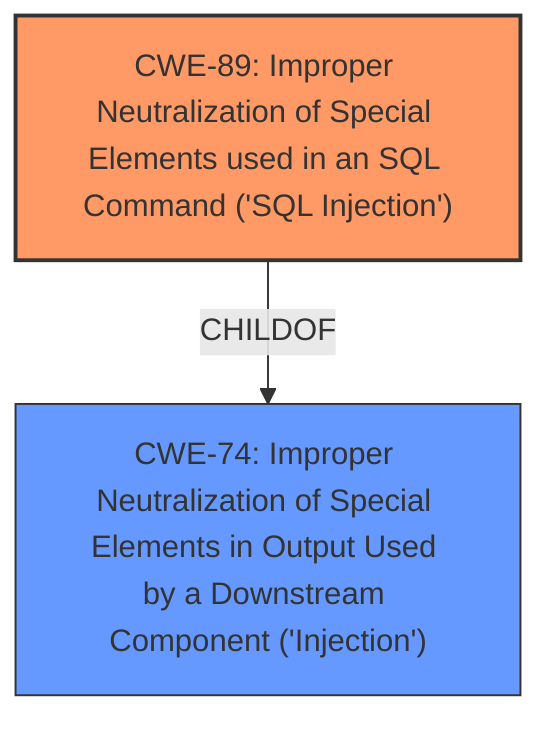

# Analysis Report for CVE-2025-5230

# Vulnerability Analysis Report: CVE-2025-5230

## Description

A vulnerability classified as critical has been found in PHPGurukul Online Nurse Hiring System 1.0. This affects an unknown part of the file /admin/bwdates-report-details.php. The manipulation of the argument fromdate/todate leads to **sql injection**. It is possible to initiate the attack remotely. The exploit has been disclosed to the public and may be used.

## Vulnerability Description Key Phrases

- **Weakness:** sql injection
- **Product:** PHPGurukul Online Nurse Hiring System
- **Version:** 1.0
- **Component:** /admin/bwdates-report-details.php

## Analysis (with Relationship Data)

# Summary
| CWE ID | CWE Name | Confidence | CWE Abstraction Level | CWE Vulnerability Mapping Label | CWE-Vulnerability Mapping Notes |
|---|---|---|---|---|---|
| CWE-89 | Improper Neutralization of Special Elements used in an SQL Command ('SQL Injection') | 1.0 | Base | Allowed | Primary CWE: The product constructs an SQL command using externally-influenced input without proper neutralization, leading to SQL injection. |

## Evidence and Confidence

*   **Confidence Score:** 1.0
*   **Evidence Strength:** HIGH

## Relationship Analysis
The primary relationship to consider here is the parent-child relationship between CWE-74 (Improper Neutralization of Special Elements in Output Used by a Downstream Component ('Injection')) and CWE-89 (Improper Neutralization of Special Elements used in an SQL Command ('SQL Injection')). While CWE-74 is a broader class, CWE-89 is a specific type of injection directly related to SQL commands, making it a more precise and suitable classification for this vulnerability.



## Vulnerability Chain
The vulnerability chain consists of a single step:

1.  **Root Cause:** **Improper neutralization** of input in `/admin/bwdates-report-details.php` leading to **SQL Injection**.
2.  **Impact:** Unauthorized database access, sensitive data leakage, data tampering, comprehensive system control, and even service interruption.

## Summary of Analysis
The primary vulnerability is **SQL injection** (CWE-89). The vulnerability description and the CVE reference summary clearly indicate that the **root cause** is the **improper handling of the 'fromdate' and 'todate' parameters** in the `/admin/bwdates-report-details.php` file, which allows attackers to inject malicious SQL code.

The selection of CWE-89 is based on the following evidence:

*   **Vulnerability Description:** States that the manipulation of the `fromdate/todate` argument leads to **sql injection**.
*   **CVE Reference Links Content Summary:** Indicates that the **root cause** is the **injection of malicious code** from the `fromdate` parameter directly into SQL queries without proper cleaning or validation.
*   **Retriever Results:** CWE-89 has the highest relevance score.

The other CWEs considered were deemed less appropriate:

*   CWE-74 (Improper Neutralization of Special Elements in Output Used by a Downstream Component ('Injection')): While this is a broader category that includes SQL injection, CWE-89 is more specific and accurately reflects the nature of the vulnerability. The guidance discourages using CWE-74 when more specific weaknesses are available.
*   CWE-79 (Improper Neutralization of Input During Web Page Generation ('Cross-site Scripting')): This is related to Cross-Site Scripting, which is not the vulnerability described.
*   CWE-434 (Unrestricted Upload of File with Dangerous Type): This is related to file uploads, which is not the vulnerability described.

The choice of CWE-89 is at the optimal level of specificity because it directly addresses the **root cause** of the vulnerability, which is the **improper neutralization** of special elements used in an SQL command.


## CWE Relationship Analysis

Current CWEs represent these abstraction levels: .


### Vulnerability Chain Analysis

**Chain starting from CWE-89:**
- 89 (Improper Neutralization of Special Elements used in an SQL Command ('SQL Injection')) - ROOT


**Chain starting from CWE-79:**
- 79 (Improper Neutralization of Input During Web Page Generation ('Cross-site Scripting')) - ROOT


### CWE Relationship Diagram

```mermaid
graph TD
    classDef primary fill:#f96,stroke:#333,stroke-width:2px
    classDef secondary fill:#69f,stroke:#333
    classDef tertiary fill:#9e9,stroke:#333
```


*Report generated on 2025-07-15 03:41:28*
