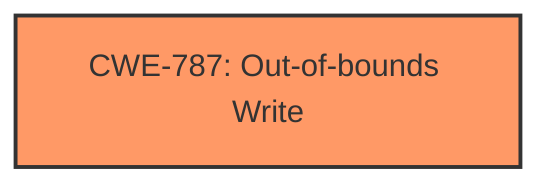

# Enhanced Analysis for CVE-2025-5244

# Summary
| CWE ID | CWE Name | Confidence | CWE Abstraction Level | CWE Vulnerability Mapping Label | CWE-Vulnerability Mapping Notes |
|---|---|---|---|---|---|
| CWE-787 | Out-of-bounds Write | 1.0 | Base | Allowed | Primary CWE |

## Evidence and Confidence

*   **Confidence Score:** 1.0
*   **Evidence Strength:** MEDIUM

## Relationship Analysis
The primary relationship considered was the direct match of "memory corruption" to the description of CWE-787. The other related CWEs from the graph-based retriever results (CWE-128, CWE-125, CWE-824, CWE-131, CWE-190, CWE-825, CWE-823, CWE-822, CWE-170) were not selected as there was insufficient evidence.



## Vulnerability Chain
The vulnerability chain consists of an out-of-bounds write leading to memory corruption.
  - Root cause: CWE-787 (Out-of-bounds Write)
  - Impact: Memory corruption

## Summary of Analysis
The vulnerability description states that a manipulation in the elf_gc_sweep function leads to **memory corruption**. The Retriever Results identify CWE-787 (Out-of-bounds Write) as the top candidate. CWE-787 is a base level CWE, which is a preferred level of abstraction.
Given that out-of-bounds writes are a common cause of memory corruption, and CWE-787's description aligns perfectly with the vulnerability description, it is the most appropriate CWE.

Relevant CWE Information:

# Enhanced Context (25 CWEs)
The following CWEs were identified as potentially relevant to this vulnerability:

## CWE-125: Out-of-bounds Read
**Abstraction Level**: Base

## CWE-252: Unchecked Return Value
**Abstraction Level**: Base

## CWE-1286: Improper Validation of Syntactic Correctness of Input
**Abstraction Level**: Base

## CWE-131: Incorrect Calculation of Buffer Size
**Abstraction Level**: Base

## CWE-824: Access of Uninitialized Pointer
**Abstraction Level**: Base

## CWE-126: Buffer Over-read
**Abstraction Level**: Variant

## CWE-193: Off-by-one Error
**Abstraction Level**: Base

## CWE-843: Access of Resource Using Incompatible Type ('Type Confusion')
**Abstraction Level**: Base

## CWE-476: NULL Pointer Dereference
**Abstraction Level**: Base

## CWE-755: Improper Handling of Exceptional Conditions
**Abstraction Level**: Class

## CWE-125: Out-of-bounds Read
**Abstraction Level**: Base

## CWE-89: Improper Neutralization of Special Elements used in an SQL Command ('SQL Injection')
**Abstraction Level**: Base

## CWE-79: Improper Neutralization of Input During Web Page Generation ('Cross-site Scripting')
**Abstraction Level**: Base

## CWE-1336: Improper Neutralization of Special Elements Used in a Template Engine
**Abstraction Level**: Base

## CWE-704: Incorrect Type Conversion or Cast
**Abstraction Level**: Class

## CWE-787: Out-of-bounds Write
**Abstraction Level**: base

**Technical Explanation:**
The vulnerability is due to an **out-of-bounds write** in the elf_gc_sweep function, leading to **memory corruption**. This directly matches the description of CWE-787 (Out-of-bounds Write).

**Security Implications:**
An **out-of-bounds write** can lead to arbitrary code execution, denial of service, or information disclosure. In this case, the impact is **memory corruption**, which can have a wide range of negative consequences.

**CWE Relationships:**
CWE-787 (Out-of-bounds Write) is a base level CWE.

**Mapping Guidance Influence:**
The official MITRE mapping guidance recommends using base level CWEs when possible, and CWE-787 is a base level CWE that accurately describes the vulnerability.

CWE-125 (Out-of-bounds Read) was considered but not selected because the vulnerability description mentions **memory corruption**, which is typically a consequence of writing, not reading, out of bounds. Other CWEs related to input validation and SQL injection (CWE-79, CWE-89, CWE-1336, CWE-704) were not considered because they are not related to the described **memory corruption** issue.


## CWE Relationship Analysis

Current CWEs represent these abstraction levels: .


### Vulnerability Chain Analysis

**Chain starting from CWE-476:**
- 476 (NULL Pointer Dereference) - ROOT


**Chain starting from CWE-125:**
- 125 (Out-of-bounds Read) - ROOT


### CWE Relationship Diagram

```mermaid
graph TD
    classDef primary fill:#f96,stroke:#333,stroke-width:2px
    classDef secondary fill:#69f,stroke:#333
    classDef tertiary fill:#9e9,stroke:#333
```