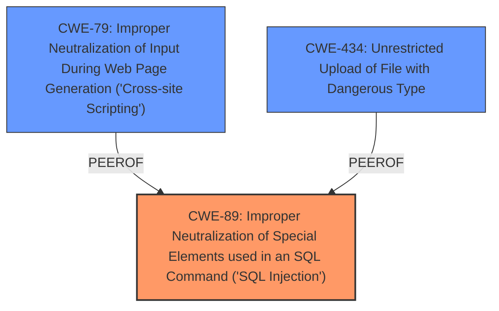

# Analysis Report for CVE-2025-5248

# Vulnerability Analysis Report: CVE-2025-5248

## Description

A vulnerability, which was classified as critical, was found in PHPGurukul Company Visitor Management System 1.0. Affected is an unknown function of the file /bwdates-reports-details.php. The manipulation of the argument fromdate/todate leads to **sql injection**. It is possible to launch the attack remotely. The exploit has been disclosed to the public and may be used.

## Vulnerability Description Key Phrases

- **Weakness:** sql injection
- **Vector:** manipulation of argument fromdate/todate
- **Product:** PHPGurukul Company Visitor Management System
- **Version:** 1.0
- **Component:** /bwdates-reports-details.php

## Analysis (with Relationship Data)

# Summary
| CWE ID | CWE Name | Confidence | CWE Abstraction Level | CWE Vulnerability Mapping Label | CWE-Vulnerability Mapping Notes |
|---|---|---|---|---|---|
| CWE-89 | Improper Neutralization of Special Elements used in an SQL Command ('SQL Injection') | 1.0 | Base | Primary | Allowed |

## Evidence and Confidence

*   **Confidence Score:** 1.0
*   **Evidence Strength:** HIGH

## Relationship Analysis
The primary relationship is the direct mapping of the vulnerability to CWE-89. Other CWEs were considered based on similarity but were not as directly relevant. The base level of abstraction for CWE-89 is appropriate as it directly describes the **SQL injection** weakness.



## Vulnerability Chain
The vulnerability chain is simple:
1.  **Root Cause:** **Improper neutralization of special elements in SQL commands (SQL injection)** due to a **lack of proper cleaning or validation of user input from the `MULTIPART fromdate` parameter.**
2.  Impact: Unauthorized database access, sensitive data leakage, data tampering, system control, service interruption.

## Summary of Analysis
The primary weakness is clearly **SQL Injection** (CWE-89) due to the **manipulation of the argument fromdate/todate** which leads to the injection.

The evidence is strong, coming directly from the vulnerability description: "The manipulation of the argument fromdate/todate leads to **sql injection**." The CVE Reference Links Content Summary explicitly states: "The root cause is the **lack of proper cleaning or validation of user input** from the `MULTIPART fromdate` parameter before it's used in SQL queries. This allows attackers to inject malicious code."

CWE-79 (Improper Neutralization of Input During Web Page Generation ('Cross-site Scripting')) and CWE-434 (Unrestricted Upload of File with Dangerous Type) were considered due to their presence in the Retriever Results, but they are not relevant to this specific vulnerability, which is focused on **SQL Injection**. CWE-89 is the optimal level of specificity as it directly addresses the root cause.

Relevant CWE Information:

# Enhanced Context (25 CWEs)
The following CWEs were identified as potentially relevant to this vulnerability:

## CWE-89: Improper Neutralization of Special Elements used in an SQL Command ('SQL Injection')
**Abstraction Level**: Base
**Similarity Score**: 0.79
**Source**: dense

**Description**:
The product constructs all or part of an SQL command using externally-influenced input from an upstream component, but it does not neutralize or incorrectly neutralizes special elements that could modify the intended SQL command when it is sent to a downstream component. Without sufficient removal or quoting of SQL syntax in user-controllable inputs, the generated SQL query can cause those inputs to be interpreted as SQL instead of ordinary user data.

**Mapping Guidance**:
- Usage: Allowed
- Rationale: This CWE entry is at the Base level of abstraction, which is a preferred level of abstraction for mapping to the root causes of vulnerabilities.


## CWE Relationship Analysis

Current CWEs represent these abstraction levels: .


### Vulnerability Chain Analysis

**Chain starting from CWE-89:**
- 89 (Improper Neutralization of Special Elements used in an SQL Command ('SQL Injection')) - ROOT


**Chain starting from CWE-79:**
- 79 (Improper Neutralization of Input During Web Page Generation ('Cross-site Scripting')) - ROOT


### CWE Relationship Diagram

```mermaid
graph TD
    classDef primary fill:#f96,stroke:#333,stroke-width:2px
    classDef secondary fill:#69f,stroke:#333
    classDef tertiary fill:#9e9,stroke:#333
```


*Report generated on 2025-07-15 03:43:31*
