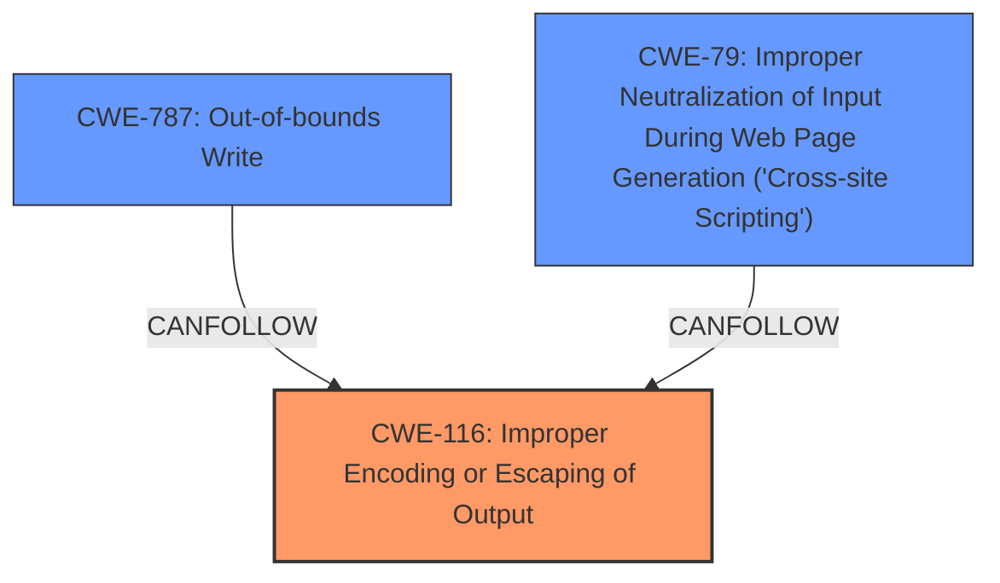

# Analysis Report for CVE-2025-5265

# Vulnerability Analysis Report: CVE-2025-5265

## Description

Due to **insufficient escaping of the ampersand character** in the Copy as cURL feature, an attacker could trick a user into using this command, potentially leading to local code execution on the users system. *This bug only affects Firefox for Windows. Other versions of Firefox are unaffected.* This vulnerability affects Firefox < 139, Firefox ESR < 115.24, Firefox ESR < 128.11, Thunderbird < 139, and Thunderbird < 128.11.

## Vulnerability Description Key Phrases

- **Component:** Copy as cURL feature
- **Rootcause:** insufficient escaping of the ampersand character
- **Vector:** tricking a user into using the command
- **Product:** Firefox, Firefox ESR, Thunderbird
- **Impact:** local code execution
- **Attacker:** attacker
- **Version:** < 139, < 115.24, < 128.11, < 139, < 128.11

## Analysis (with Relationship Data)

# Summary
| CWE ID | CWE Name | Confidence | CWE Abstraction Level | CWE Vulnerability Mapping Label | CWE-Vulnerability Mapping Notes |
|---|---|---|---|---|---|
| CWE-116 | Improper Encoding or Escaping of Output | 0.9 | Class | Allowed-with-Review | Primary CWE |
| CWE-787 | Out-of-bounds Write | 0.5 | Base | Allowed | Secondary Candidate |
| CWE-79 | Improper Neutralization of Input During Web Page Generation ('Cross-site Scripting') | 0.4 | Base | Allowed | Secondary Candidate |

## Evidence and Confidence

*   **Confidence Score:** 0.9
*   **Evidence Strength:** HIGH

## Relationship Analysis
The primary CWE, CWE-116, is a Class, while the retriever results also listed several Base level CWEs. Given the **insufficient escaping of the ampersand character** in the Copy as cURL feature, CWE-116 is the most appropriate as it is a Class level CWE that encompasses the general problem. The other CWEs, such as CWE-787, CWE-79, and CWE-125, are possible impacts of the **insufficient escaping**, but are not the root cause.



## Vulnerability Chain
The vulnerability chain starts with **insufficient escaping of the ampersand character** (CWE-116). This can lead to the user being tricked into executing a command that can cause local code execution. The local code execution could potentially involve writing past the end of a buffer (CWE-787) or cause script to run (CWE-79).

## Summary of Analysis
The initial analysis and subsequent refinement focused on identifying the root cause of the vulnerability. The evidence points to **insufficient escaping of the ampersand character** in the "Copy as cURL" feature. This **insufficient escaping** leads to potential local code execution. The retriever results suggested several CWEs, including CWE-787 and CWE-79. However, these are potential consequences of the **insufficient escaping**, not the root cause itself.

The selection of CWE-116 is based on the vulnerability description stating the **insufficient escaping of the ampersand character**. The complete CWE specification of CWE-116 states: "The product prepares a structured message for communication with another component, but encoding or escaping of the data is either missing or done incorrectly. As a result, the intended structure of the message is not preserved." This aligns perfectly with the vulnerability description, which states that the **insufficient escaping** of the ampersand character can lead to local code execution.

The final decision to use CWE-116 is based on the evidence provided in the vulnerability description and the complete CWE specifications. The retriever scores are used as supporting evidence, but the final decision is based on the evidence and the complete CWE specifications.

Relevant CWE Information:

# Enhanced Context (25 CWEs)
The following CWEs were identified as potentially relevant to this vulnerability:

## CWE-451: User Interface (UI) Misrepresentation of Critical Information
**Abstraction Level**: Class
**Similarity Score**: 0.75
**Source**: dense

**Description**:
The user interface (UI) does not properly represent critical information to the user, allowing the information - or its source - to be obscured or spoofed. This is often a component in phishing attacks.

**Mapping Guidance**:
- Usage: Allowed-with-Review
- Rationale: This CWE entry is a Class and might have Base-level children that would be more appropriate

*Not Selected:* This is not the primary issue; the core problem is the **insufficient escaping**.

## CWE-116: Improper Encoding or Escaping of Output
**Abstraction Level**: Class
**Similarity Score**: 0.75
**Source**: dense

**Description**:
The product prepares a structured message for communication with another component, but encoding or escaping of the data is either missing or done incorrectly. As a result, the intended structure of the message is not preserved.

**Mapping Guidance**:
- Usage: Allowed-with-Review
- Rationale: This CWE entry is a Class and might have Base-level children that would be more appropriate

*Selected:* This is the root cause of the vulnerability as there is **insufficient escaping of the ampersand character**.

## CWE-80: Improper Neutralization of Script-Related HTML Tags in a Web Page (Basic XSS)
**Abstraction Level**: Variant
**Similarity Score**: 0.74
**Source**: dense

**Description**:
The product receives input from an upstream component, but it does not neutralize or incorrectly neutralizes special characters such as "<", ">", and "&" that could be interpreted as web-scripting elements when they are sent to a downstream component that processes web pages.

**Mapping Guidance**:
- Usage: Allowed
- Rationale: This CWE entry is at the Variant level of abstraction, which is a preferred level of abstraction for mapping to the root causes of vulnerabilities.

*Possibly Secondary:* This could be a secondary issue if the **insufficient escaping** leads to the injection of HTML tags.

## CWE-346: Origin Validation Error
**Abstraction Level**: Class
**Similarity Score**: 0.73
**Source**: dense

**Description**:
The product does not properly verify that the source of data or communication is valid.

**Mapping Guidance**:
- Usage: Allowed-with-Review
- Rationale: This CWE entry is a Class and might have Base-level children that would be more appropriate

*Not Selected:* This is not relevant to the vulnerability description.

## CWE-125: Out-of-bounds Read
**Abstraction Level**: Base
**Similarity Score**: 0.73
**Source**: dense

**Description**:
The product reads data past the end, or before the beginning, of the intended buffer.

**Mapping Guidance**:
- Usage: Allowed
- Rationale: This CWE entry is at the Base level of abstraction, which is a preferred level of abstraction for mapping to the root causes of vulnerabilities.

*Not Selected:* This is an impact from the local code execution, and not the root cause.

## CWE-923: Improper Restriction of Communication Channel to Intended Endpoints
**Abstraction Level**: Class
**Similarity Score**: 0.73
**Source**: dense

**Description**:
The product establishes a communication channel to (or from) an endpoint for privileged or protected operations, but it does not properly ensure that it is communicating with the correct endpoint.

**Mapping Guidance**:
- Usage: Allowed-with-Review
- Rationale: This CWE entry is a Class and might have Base-level children that would be more appropriate

*Not Selected:* This is not relevant to the vulnerability description.

## CWE-41: Improper Resolution of Path Equivalence
**Abstraction Level**: Base
**Similarity Score**: 0.73
**Source**: dense

**Description**:
The product is vulnerable to file system contents disclosure through path equivalence. Path equivalence involves the use of special characters in file and directory names. The associated manipulations are intended to generate multiple names for the same object.

**Mapping Guidance**:
- Usage: Allowed
- Rationale: This CWE entry is at the Base level of abstraction, which is a preferred level of abstraction for mapping to the root causes of vulnerabilities.

*Not Selected:* This is not relevant to the vulnerability description.

## CWE-610: Externally Controlled Reference to a Resource in Another Sphere
**Abstraction Level**: Class
**Similarity Score**: 0.73
**Source**: dense

**Description**:
The product uses an externally controlled name or reference that resolves to a resource that is outside of the intended control sphere.

**Mapping Guidance**:
- Usage: Discouraged
- Rationale: This CWE entry is a level-1 Class (i.e., a child of a Pillar). It might have lower-level children that would be more appropriate

*Not Selected:* This is not relevant to the vulnerability description.

## CWE-843: Access of Resource Using Incompatible Type ('Type Confusion')
**Abstraction Level**: Base
**Similarity Score**: 0.72
**Source**: dense

**Description**:
The product allocates or initializes a resource such as a pointer, object, or variable using one type, but it later accesses that resource using a type that is incompatible with the original type.

**Mapping Guidance**:
- Usage: Allowed
- Rationale: This CWE entry is at the Base level of abstraction, which is a preferred level of abstraction for mapping to the root causes of vulnerabilities.

*Not Selected


## CWE Relationship Analysis

Current CWEs represent these abstraction levels: .


### Vulnerability Chain Analysis

**Chain starting from CWE-116:**
- 116 (Improper Encoding or Escaping of Output) - ROOT


**Chain starting from CWE-610:**
- 610 (Externally Controlled Reference to a Resource in Another Sphere) - ROOT


### CWE Relationship Diagram

```mermaid
graph TD
    classDef primary fill:#f96,stroke:#333,stroke-width:2px
    classDef secondary fill:#69f,stroke:#333
    classDef tertiary fill:#9e9,stroke:#333
```


*Report generated on 2025-07-15 03:46:01*
