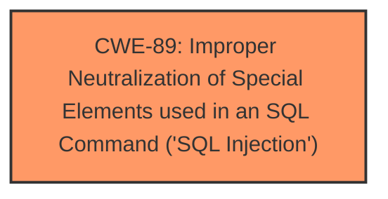

# Analysis for CVE-2025-5367

# Summary

| CWE ID | CWE Name | Confidence | CWE Abstraction Level | CWE Vulnerability Mapping Label | CWE-Vulnerability Mapping Notes |
|---|---|---|---|---|---|
| CWE-89 | Improper Neutralization of Special Elements used in an SQL Command ('SQL Injection') | 1.0 | Base | Primary | Allowed |

## Evidence and Confidence

*   **Confidence Score:** 1.0
*   **Evidence Strength:** HIGH

## Relationship Analysis

The primary CWE is CWE-89, which is a base-level CWE. There are no direct parent or child relationships significantly impacting the decision in this case, as the description clearly points to SQL Injection. The other CWEs are not chosen since the root cause is clearly indicated as SQL Injection.

## Vulnerability Chain

The vulnerability chain starts with **improper neutralization** of special elements, leading directly to **SQL Injection**.

## Summary of Analysis

The vulnerability description clearly states that the manipulation of the argument "Product" leads to **SQL Injection** in the `/category.php` file of PHPGurukul Online Shopping Portal Project 1.0. The key phrase "sql injection" confirms this.

The Retriever Results also lists CWE-89 as the top hit with a score of 1.0 based on alternate_terms.

Therefore, the most appropriate CWE is CWE-89, which represents the **improper neutralization** of special elements used in an SQL command, leading to **SQL Injection**. This is a Base level CWE, which is the preferred level of abstraction.

CWE-79, CWE-434, CWE-117, CWE-1336, CWE-99, CWE-74, CWE-116, CWE-96, CWE-73 were considered but not used because the vulnerability description points directly to SQL Injection.