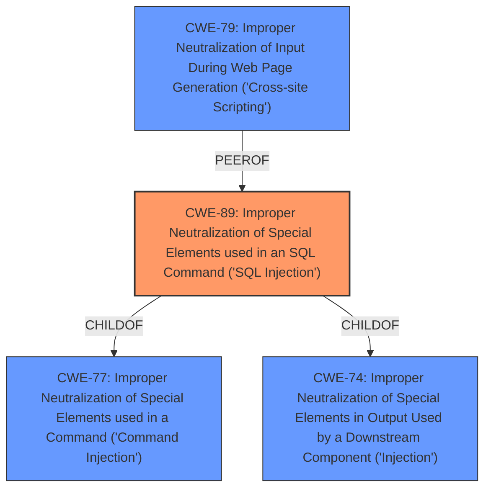

# Enhanced Analysis for CVE-2025-5375

# Summary

| CWE ID  | CWE Name                                                                            | Confidence | CWE Abstraction Level | CWE Vulnerability Mapping Label | CWE-Vulnerability Mapping Notes |
| ------- | ----------------------------------------------------------------------------------- | ---------- | ----------------------- | ------------------------------- | ------------------------------- |
| CWE-89  | Improper Neutralization of Special Elements used in an SQL Command ('SQL Injection') | 1          | Base                    | Primary                         | Allowed                         |
| CWE-79  | Improper Neutralization of Input During Web Page Generation ('Cross-site Scripting') | 0.3          | Base                    | Secondary                       | Allowed                         |

## Evidence and Confidence

*   **Confidence Score:** 0.9
*   **Evidence Strength:** HIGH

## Relationship Analysis

The primary relationship to consider is that CWE-89 is a base-level CWE, representing a specific type of injection vulnerability. It is a child of CWE-77: Improper Neutralization of Special Elements used in a Command ('Command Injection') and CWE-74: Improper Neutralization of Special Elements in Output Used by a Downstream Component ('Injection'). CWE-79 (Cross-site Scripting) is a peer vulnerability that involves improper neutralization, but for web page generation instead of SQL commands.



## Vulnerability Chain

The vulnerability chain starts with the **improper neutralization** of the `del` parameter in the `/admin/registered-users.php` file, leading to **SQL Injection**. This allows an attacker to execute arbitrary SQL commands, potentially leading to unauthorized database access, data leakage, or data manipulation.

## Summary of Analysis

The primary weakness is clearly **SQL Injection**, due to the **improper neutralization** of the `del` parameter.

The evidence for CWE-89 is very strong:
*   The **Vulnerability Description** states: "The manipulation of the argument del leads to **sql injection**."
*   The **CVE Reference Links Content Summary** confirms: "The vulnerability stems from insufficient validation of user input for the "del" parameter in the `/admin/registered-users.php` file. This allows attackers to inject malicious SQL queries." Also "Weaknesses/vulnerabilities present: SQL Injection"
*   The **Retriever Results** list CWE-89 as the top match with a score of 1.000.

CWE-79 was considered as a secondary weakness, but there is no evidence that this vulnerability leads to Cross-site Scripting.

The selection of CWE-89 as the primary CWE is appropriate because it accurately reflects the root cause of the vulnerability, which is the **improper neutralization** of special elements used in an SQL command. The other CWEs were considered, but they did not match the vulnerability description as closely as CWE-89.

Relevant CWE Information:

# Enhanced Context (25 CWEs)
The following CWEs were identified as potentially relevant to this vulnerability:

## CWE-89: Improper Neutralization of Special Elements used in an SQL Command ('SQL Injection')
**Abstraction Level**: Base
**Similarity Score**: 0.77
**Source**: dense

**Description**:
The product constructs all or part of an SQL command using externally-influenced input from an upstream component, but it does not neutralize or incorrectly neutralizes special elements that could modify the intended SQL command when it is sent to a downstream component. Without sufficient removal or quoting of SQL syntax in user-controllable inputs, the generated SQL query can cause those inputs to be interpreted as SQL instead of ordinary user data.

**Mapping Guidance**:
- Usage: Allowed
- Rationale: This CWE entry is at the Base level of abstraction, which is a preferred level of abstraction for mapping to the root causes of vulnerabilities.
## CWE-79: Improper Neutralization of Input During Web Page Generation ('Cross-site Scripting')
**Abstraction Level**: Base
**Similarity Score**: 2.98
**Source**: graph

**Description**:
The product does not neutralize or incorrectly neutralizes user-controllable input before it is placed in output that is used as a web page that is served to other users.

**Mapping Guidance**:
- Usage: Allowed
- Rationale: This CWE entry is at the Base level of abstraction, which is a preferred level of abstraction for mapping to the root causes of vulnerabilities.

**Relationships**:
- PARENTOF -> CWE-87
- PARENTOF -> CWE-86
- PARENTOF -> CWE-85
- PARENTOF -> CWE-84
- PARENTOF -> CWE-83


## CWE Relationship Analysis

Current CWEs represent these abstraction levels: .


### Vulnerability Chain Analysis

**Chain starting from CWE-87:**
- 87 (Improper Neutralization of Alternate XSS Syntax) - ROOT


**Chain starting from CWE-89:**
- 89 (Improper Neutralization of Special Elements used in an SQL Command ('SQL Injection')) - ROOT


### CWE Relationship Diagram

```mermaid
graph TD
    classDef primary fill:#f96,stroke:#333,stroke-width:2px
    classDef secondary fill:#69f,stroke:#333
    classDef tertiary fill:#9e9,stroke:#333
```